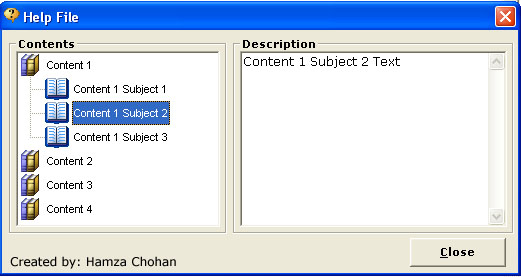



## Simple Help File in vb6

### Description

this is a simple example of making an help topics file in vb6. so please VOTE for me.

if you need any help just free to send me a mail and i will help you in any problem of vb6

Email: hamzajhang@yahoo.com & & Thanks & & Happy Coding.......
 
### More Info
 

             |
---                |---
**Submitted On**   |2010-07-07 11:23:24
**By**             |[HAmza ChohAn](https://github.com/Planet-Source-Code/PSCIndex/blob/master/ByAuthor/hamza-chohan.md)
**Level**          |Beginner
**User Rating**    |4.8 (24 globes from 5 users)
**Compatibility**  |VB 6\.0
**Category**       |[Miscellaneous](https://github.com/Planet-Source-Code/PSCIndex/blob/master/ByCategory/miscellaneous__1-1.md)
**World**          |[Visual Basic](https://github.com/Planet-Source-Code/PSCIndex/blob/master/ByWorld/visual-basic.md)
**Archive File**   |[Simple\_Hel218431772010\.zip](https://github.com/Planet-Source-Code/hamza-chohan-simple-help-file-in-vb6__1-73253/archive/master.zip)

